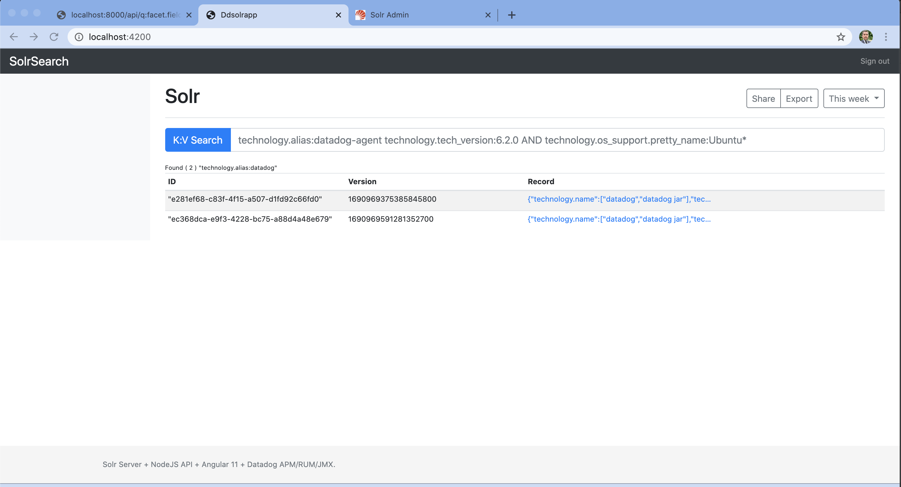

# DdSolrApp Quick Lab

The current project is used to test the integration of Datadog with Angular, NodeJS, Apache Solr in order to gain visibility and observability of the entire infrastructure.

The main purpose is to have full correlation from Infra, Traces, Logs, JVM metrics, APM traces on NodeJS applications, RUM activity.

## Installation & Setup

I provide two scripts to get you started very quickly:

* `setup.sh "<DATADOG-API-KEY>"` : create & configure the `Vagrantfile`.
* `workspace/provision.sh`: is registered within the `Vagrantfile`.
  * Download & Install via script:
    * Datadog Agent & `dd-java-agent.jar`
    * Apache Solr: add Datadog JAR for APM tracing
    * Node.JS, NPM, YARN Package Manager, Angular CLI 11.x

## Configurations

Once the Vagrant setup has completed, your will be logged into vagrant, in the event it does not just run `vagrant ssh`.

Use 2 separate ssh sessions to perform the following:
* Change directory to `cd /home/vagrant/workspace` 
* Start the Node.JS server: `node nodeServer/server.js`
* Start the Angular App server: `ng serve --host 0.0.0.0 --port 4200`
    * `--host 0.0.0.0` will allow connections in your local host (outside of Vagrant)
    * `--port 4200` is the Angular port for your web app
* Start the Apache Solr server: `sudo systemctl start solr`
    * The script should have created a core named technoloy and loaded 2 records
    * Test Apache Solr with `curl "http://localhost:8983/solr/technology/select?q=*:*`
* RUM must be instrumented for Angular app server & Node.JS, please the [Datadog RUM](https://app.datadoghq.com/rum) instructions when creating a new app, this will give you complete instructions for your system. Inject the RUM code for your Node.JS + Angular web app.

Query Apache Solr records through the SolrSearch app by going to `http://localhost:4200/` and using the Datadog Tag approach  to retrieve records. Below is a list of keys that can be used in the interface:

* Single key search: `technology.alias:Datadog`
* Multiple key search: `technology.alias:Datadog technology.name:datadog`; `technology.alias:Datadog AND technology.name:datadog`;
* Wildcard search: `technology.alias:Datad*` **Limited to a single wildcard search**


```csv
"id","technology.alias","technology.name","technology.os_support.bug_report_url","technology.os_support.distrib_codename","technology.os_support.distrib_description","technology.os_support.distrib_id","technology.os_support.distrib_release","technology.os_support.home_url","technology.os_support.id","technology.os_support.id_like","technology.os_support.name","technology.os_support.pretty_name","technology.os_support.support_url","technology.os_support.ubuntu_codename","technology.os_support.version","technology.os_support.version_codename","technology.os_support.version_id","technology.tech_conf","technology.tech_confdir","technology.tech_firstconf","technology.tech_type","technology.tech_version"
```


