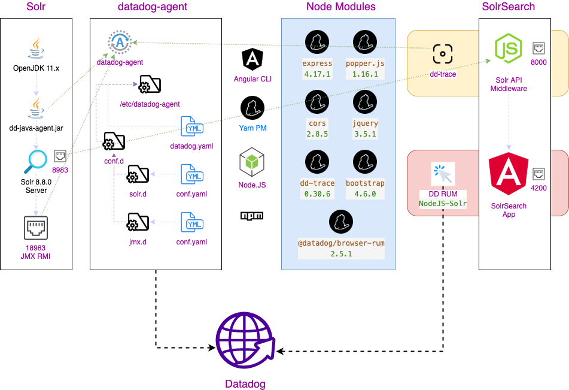
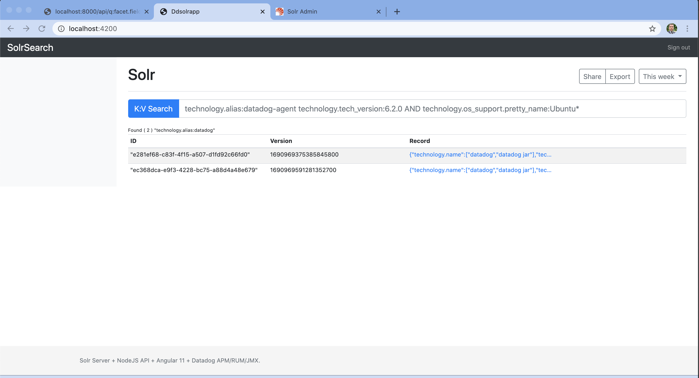
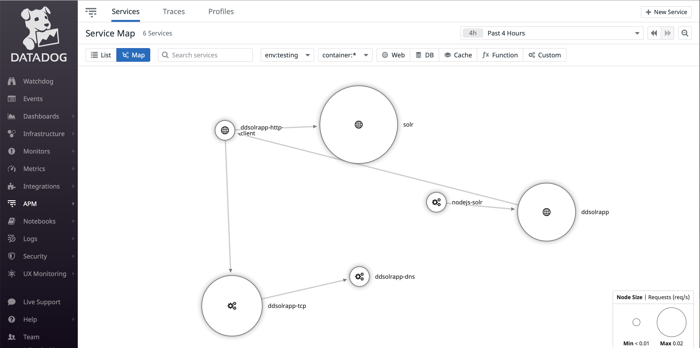
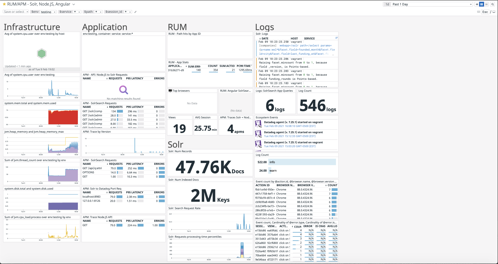

# DdSolrApp Quick Lab

The current project is used to test the integration of Datadog with Angular, NodeJS, Apache Solr in order to gain visibility and observability of the entire infrastructure.

The main purpose is to have full correlation from Infra, Traces, Logs, JVM metrics, APM traces on NodeJS applications, RUM activity.

## Installation & Setup

I provide two scripts to get you started very quickly:

* `setup.sh "<DATADOG-API-KEY>"` : create & configure the `Vagrantfile`.
* `workspace/provision.sh`: is registered within the `Vagrantfile`.
  * Download & Install via script:
    * Datadog Agent & `dd-java-agent.jar`
    * Apache Solr: add Datadog JAR for APM tracing
    * Node.JS, NPM, YARN Package Manager, Angular CLI 11.x

## Configure Datadog

> Solr `rmi.port=18983` & `dd-java-agent` Configuration

* Configurations are pushed by the `provision.sh`

> `datadog-agent` configurations:

* `/etc/datadog-agent/datadog.yaml` - to enable [Application Performance Monitor for Node.JS](https://docs.datadoghq.com/tracing/setup_overview/setup/nodejs/?tab=containers)
```yaml
apm_config:
  enabled: true

logs_enabled: true
```

* `/etc/datadog-agent/conf.d/solr.d/conf.yaml` - to enable [Solr integration](https://docs.datadoghq.com/integrations/solr/?tab=host)
```yaml
init_config:
    is_jmx: true
    collect_default_metrics: true

instances:
  - host: localhost
    port: 18983

logs:
   - type: file
     path: /var/solr/logs/solr.log
     source: solr
     #  To handle multi line that starts with yyyy-mm-dd use the following pattern
     log_processing_rules:
       - type: multi_line
         pattern: \d{4}\-(0?[1-9]|1[012])\-(0?[1-9]|[12][0-9]|3[01])
         name: new_log_start_with_date
```

* `/etc/datadog-agent/conf.d/jmx.d/conf.yaml` - to enable [JMX](https://docs.datadoghq.com/integrations/java/?tab=host#overview) collection metrics (optional & not covered in this example)

> `dd-trace` - to trace Node.JS middleware API (Solr to Node.JS)

* `node --require dd-trace/init nodeServer/server.js`

> `@datadog/browser-rum dd-trace` - for [Datadog: Connect RUM & APM Traces](https://docs.datadoghq.com/real_user_monitoring/connect_rum_and_traces/?tab=browserrum#pagetitle) in Angular 11.x app

* Inject the following into `workspace/ddsolrapp/src/app.components.ts`
```node
import { datadogRum } from '@datadog/browser-rum';

datadogRum.init({
    applicationId: '<datadog-app-id>',
    clientToken: '<datadog-client-token>',
    site: 'datadoghq.com',
    service: 'NodeJS-Solr',
    env: 'testing',
    version: '1.0.0',
    sampleRate: 100,
    trackInteractions: true,
    // Enable APM tracing on the RUM transaction
    allowedTracingOrigins: ["http://localhost",/http:\/\/localhost/]
});
```


## Starting Up the SolrSearch App

Once the Vagrant setup has completed, your will be logged into vagrant, in the event it does not just run `vagrant ssh`.

Use 2 separate ssh sessions to perform the following:
* Change directory to `cd /home/vagrant/workspace` 
* Start the Node.JS server: `node nodeServer/server.js`
* Change directory into the app `cd ddsolrapp`
* Use yarn to install the npm modules `yarn install`
* Start the Angular App server: `ng serve --host 0.0.0.0 --port 4200`
    * `--host 0.0.0.0` will allow connections in your local host (outside of Vagrant)
    * `--port 4200` is the Angular port for your web app
* Start the Apache Solr server: `sudo systemctl start solr`
    * The script should have created a core named technoloy and loaded 2 records
    * Test Apache Solr with `curl "http://localhost:8983/solr/technology/select?q=*:*`
* RUM must be instrumented for Angular app server & Node.JS, please the [Datadog RUM](https://app.datadoghq.com/rum) instructions when creating a new app, this will give you complete instructions for your system. Inject the RUM code for your Node.JS + Angular web app.

> Architecture

 [Draw.io - DdSolrApp](workspace/imgs/DdSolrApp.drawio)

> SolrSearch

Query Apache Solr records through the SolrSearch app by going to `http://localhost:4200/` and using the Datadog Tag approach  to retrieve records. Below is a list of keys that can be used in the interface:

* Single key search: `technology.alias:Datadog`
* Multiple key search: `technology.alias:Datadog technology.name:datadog`; `technology.alias:Datadog AND technology.name:datadog`;
* Wildcard search: `technology.alias:Datad*` **Limited to a single wildcard search**


```csv
"id","technology.alias","technology.name","technology.os_support.bug_report_url","technology.os_support.distrib_codename","technology.os_support.distrib_description","technology.os_support.distrib_id","technology.os_support.distrib_release","technology.os_support.home_url","technology.os_support.id","technology.os_support.id_like","technology.os_support.name","technology.os_support.pretty_name","technology.os_support.support_url","technology.os_support.ubuntu_codename","technology.os_support.version","technology.os_support.version_codename","technology.os_support.version_id","technology.tech_conf","technology.tech_confdir","technology.tech_firstconf","technology.tech_type","technology.tech_version"
```

> [Datadog Service Map](https://docs.datadoghq.com/tracing/visualization/services_map/#pagetitle)

* `solr` - the Solr server
* `ddsolrapp-http-client` - the API call
* `ddsolrapp-tcp` - the DD call
* `ddsolrapp-dns` - the DNS DD request call
* `nodejs-solr` - the Angular RUM call
* `ddsolrapp` - the Angular UI



## Unify the Data

The project's data points are now flowing into Datadog throught he different integrations. The dashboard contains a lot of great information needed to create a command center based on the SolrSearch App (Front End) to the Node.JS tracing + searching the Solr server records. 

* Infrastructure: CPU, Memory, Hosts, JVM Heap, Disk
* Application: traces by service
* Real User Monitoring - RUM: Session, resources, views, browser
* Solr: requests, indexes, records
* Logs: correlation by request type
* Events: agent information  
* All correlated elements by time, session, service, or view id

> [Datadog Dashboard](workspace/imgs/RUM_APM-Solr,Node.JS,Angular--2021-02-09T23_23_56.json)

